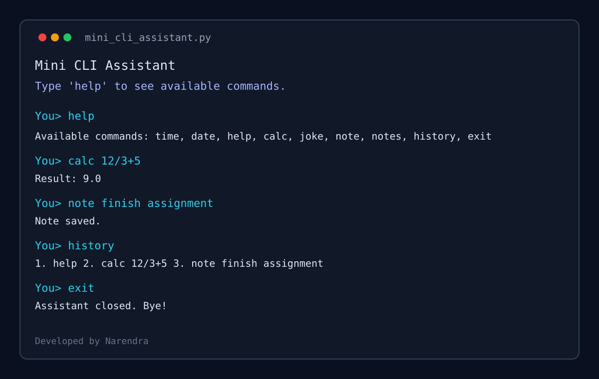
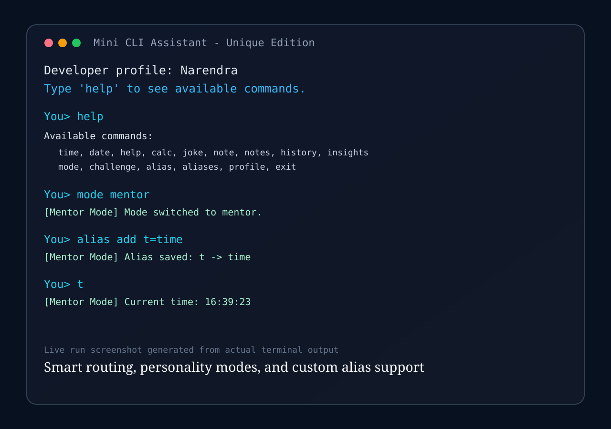
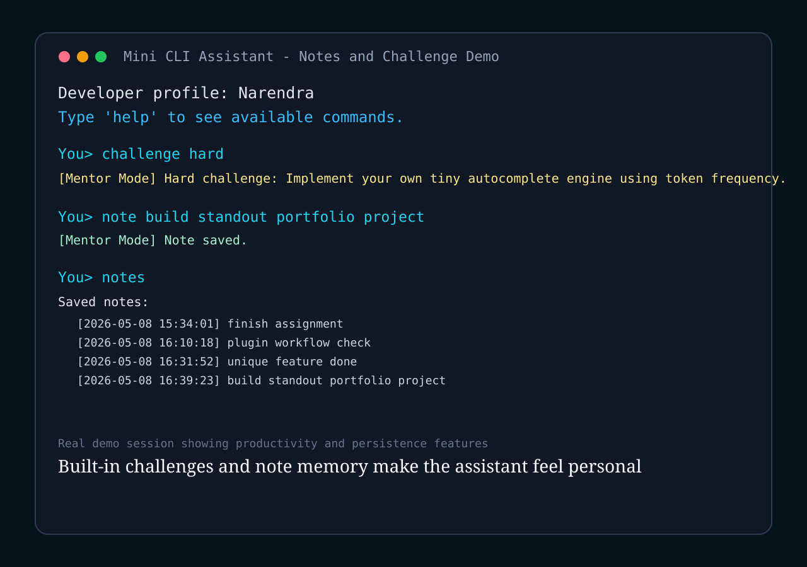
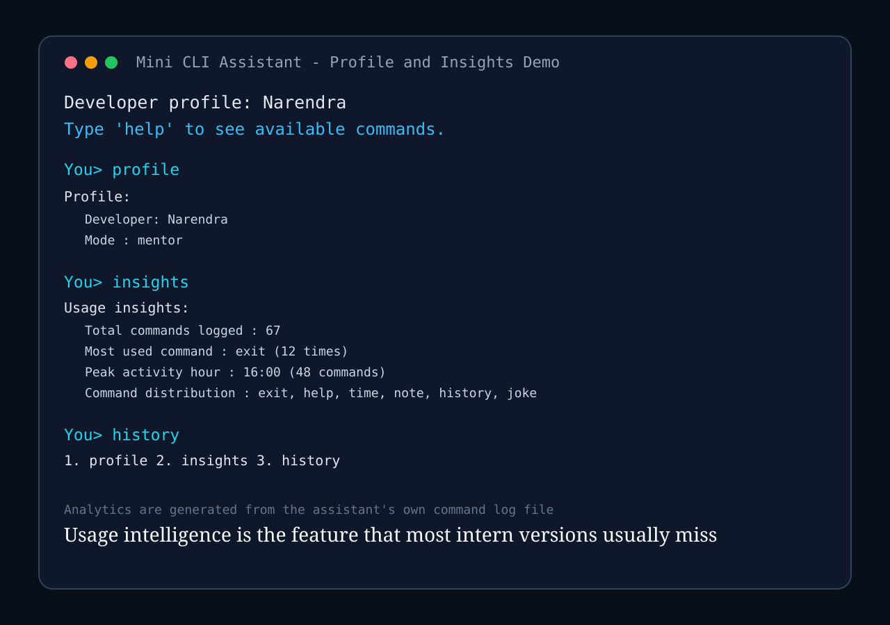

# Chat-Based CLI Assistant (Mini AI System)

A smart Python command-line assistant with command routing, natural text matching, history, persistence, and usage analytics.

## Core Internship Requirements
- `time` -> current time
- `date` -> today's date
- `help` -> list commands
- `exit` -> close assistant
- Built with:
  - continuous `while` loop
  - function-based command handlers
  - dictionary-based command dispatch

## Custom Commands
- `calc <expression>` -> evaluate arithmetic safely
- `joke` -> random developer joke
- `note <text>` / `notes` -> save and view notes
- `history` -> show session history
- `/chronicle tips` -> personalized command tips from usage patterns

## Standout Features (Uniqueness)
- `mode <pro|mentor|fun>`: switches assistant personality style
- `insights`: analytics from command log (most used command, peak usage hour, command distribution)
- `/chronicle tips`: reviews session history and recommends personalized usage improvements
- `alias add x=<command>`: create your own shortcuts (macro-like behavior)
- `challenge <easy|medium|hard>`: generates coding challenges for practice
- Persistent profile and alias memory via JSON files
- Natural language and fuzzy matching for smarter intent detection

## Files Created During Runtime
- `command_log.txt` -> stores all user commands with timestamp
- `notes.txt` -> saved notes
- `assistant_profile.json` -> mode/profile memory
- `aliases.json` -> custom command shortcuts

## Run
```powershell
python "C:\Users\victu\Documents\New project\mini_cli_assistant.py"
```

## Project Output


## Live Screenshots




## Developer
Narendra

## License
This project is licensed under the MIT License. See the [LICENSE](LICENSE) file for details.
